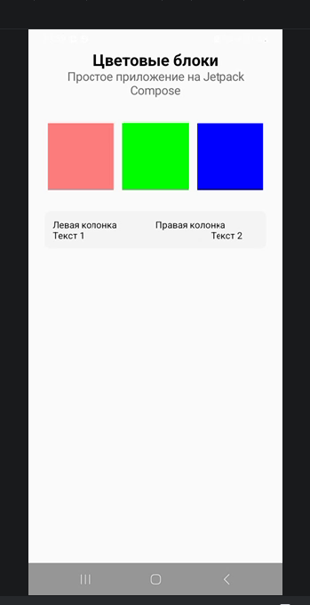

# Лабораторная работа №5. Jetpack Compose: контейнеры, ARGB-модель и Material Design
---
**ФИО:** Дунюшкин Никита | Салалыкина Олеся
**Группа:** ИСП-233

---

### Цель работы: 
Повторить основы разработки пользовательского интерфейса на
Jetpack Compose, работу с контейнерами Row и Column, познакомиться с ARGBмоделью цветов, компонентом Scaffold и принципами Material Design.

### Описание работы
Было создано простое приложение на Jetpack Compose с реализацией главного экрана, так же на этом экране присутствуют: заголовок из двух строк текста, горизонтальный ряд из трёх цветных квадратов, один квадрат должен быть полупрозрачным, один контейнер с вложенными Row и Column. Цвета были заданы в ARGB-формате

### Скриншоты 

